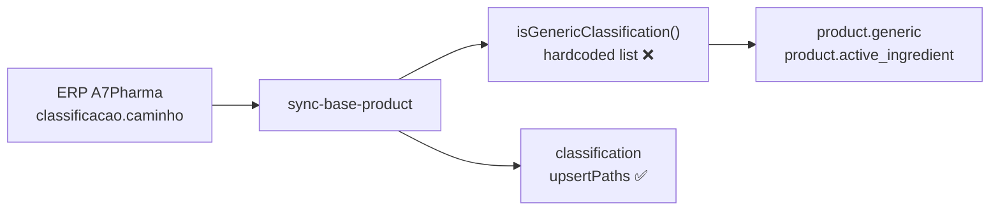
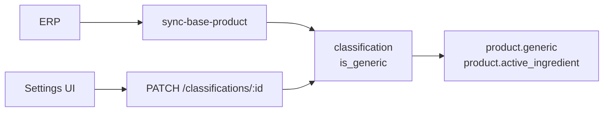

# 11 — Configurable generic classifications (per tenant)

> **Status: 📋 Planning — not implemented.** Replaces the hardcoded generic-classification list in `sync-base-product` with a per-tenant database flag the pharmacy can manage in the UI.

---

## Summary — why this matters

Today, to decide whether a product is **generic** (and therefore show **active ingredient** on the active-ingredient analysis screen), the system compares the product's ERP category against a **fixed list hardcoded in source**. When the ERP renames a category — accents, spacing, new labels (`GENÉRICO > PSICO GENÉRICO > A1` vs `GENERICO > PSICOS GENERICO > A1-GEN`) — the product silently stops counting as generic. The screen stays empty even with thousands of imported products.

**With this change:**

- Each pharmacy sees **its own categories** imported from the ERP, on a settings screen.
- An operator marks which categories are generic — **no deploy required** when the ERP renames something.
- On the next product import, the system uses that configuration automatically.
- New categories from the ERP appear on import; the user only marks generics **when they appear** (a rare event).

**Direct impact:** active-ingredient analysis, generic filters, and any feature depending on `active_ingredient` reflect the **tenant's business decision**, not a list maintained by developers.

---

## The original bug

**Symptom:** empty **Active ingredient analysis** screen (`/macfarma/analise-principio-ativo`) despite imported products.

**Root cause:** in `sync-base-product`, active ingredient is written only when `isGenericClassification(classificationPath)` returns `true`. That function compared the ERP path against a **hardcoded list** in `sync-base-product.step.ts`. Real A7Pharma paths moved to different naming (`GENÉRICO > …` with accents and new segments), so **no product was classified as generic** → `active_ingredient` stayed `NULL` for all rows.

**Temporary mitigation (local branch):** expand the code list + normalize comparison (strip accents and spaces). That **unblocks one tenant** while the ERP uses exactly those paths, but:

- Every tenant / ERP naming change requires a new deploy.
- The list duplicates legacy and current nomenclature.
- Operators have no visibility or control.

**Affected flow docs:** [`docs/analise-principio-ativo-data-flow.md`](../docs/analise-principio-ativo-data-flow.md) §5–6.

---

## Current behavior (code)

| Piece | What already exists |
|---|---|
| `classification` table (per tenant) | Tree `(name, parent_id)` + `visible` column. **No generic flag.** |
| Import on sync | `ClassificationRepository.upsertPaths()` already creates missing categories on every `sync-base-product` run — **no separate cron needed.** |
| Product | `product.classification_id` points to the tree **leaf**. |
| Read API | `GET /classifications` and `GET /classifications/grouped` — used by the front end for offer rules and suggestions. |
| Generic today | Hardcoded list + `product.generic` / `product.active_ingredient` set in the pipeline. |



---

## Proposed solution

Add **`is_generic boolean NOT NULL DEFAULT false`** on `classification` (leaf = row referenced by `product.classification_id`).

1. **Import (existing):** on each `sync-base-product`, `upsertPaths` keeps ensuring ERP categories exist. New leaves start with `is_generic = false`.
2. **Business decision (new):** tenant admin marks leaves as generic via UI → `PATCH /classifications/:id`.
3. **Pipeline (changed):** instead of the hardcoded list, `sync-base-product` reads `is_generic` from the leaf (`classification_id`) to set `generic` and `active_ingredient`.



**No category cron:** ERP category changes are rare; the import hook already covers creation. Only the generic flag is edited manually (or via one-time seed).

---

## Pros and cons

| Pros | Cons |
|---|---|
| Each tenant configures its own ERP — scales to **all tenants** without deploy | Requires **initial setup** per tenant (seed + UI review) |
| ERP renames no longer fail silently — new category appears, user marks it | New categories arrive as **non-generic** until someone marks them (operational risk if nobody reviews) |
| Removes ~50 lines of magic list and fragile normalization | New UI and API (front + back scope) |
| Reuses **existing** table and import path | Flag on **leaf** only — future “whole GENÉRICO subtree” needs inheritance rules (out of v1) |
| Auditable: `updated_at` shows when someone marked generic | Product re-sync needed after flag changes to backfill `active_ingredient` |

---

## Technical scope

### 1. Database — tenant migration

**File:** new migration under `migrations/tenant/`.

```sql
ALTER TABLE classification
  ADD COLUMN is_generic boolean NOT NULL DEFAULT false;

CREATE INDEX "IX_CLASSIFICATION_IS_GENERIC"
  ON classification(is_generic)
  WHERE is_generic = true AND deleted_at IS NULL;
```

- Run on **all schemas** via `npm run migration:tenant:all` (or existing migrate pipeline).
- Update `ClassificationEntity` in [`src/database/entities/tenant/classification.entity.ts`](../src/database/entities/tenant/classification.entity.ts).

### 2. Initial seed — all existing tenants

One-shot script **`scripts/seed-classification-generics.ts`** (or deploy task):

1. List active tenants in `core.tenant`.
2. Per schema, build the **full path** of each leaf:
   ```sql
   WITH RECURSIVE tree AS (
     SELECT id, name, parent_id, name AS path
       FROM classification WHERE parent_id IS NULL AND deleted_at IS NULL
     UNION ALL
     SELECT c.id, c.name, c.parent_id, t.path || ' > ' || c.name
       FROM classification c
       JOIN tree t ON c.parent_id = t.id
      WHERE c.deleted_at IS NULL
   )
   SELECT id, path FROM tree t
    WHERE NOT EXISTS (
      SELECT 1 FROM classification ch
       WHERE ch.parent_id = t.id AND ch.deleted_at IS NULL
    );
   ```
3. Normalize path (same rule as today: NFD, strip accents, strip spaces, uppercase) and match against the **legacy list** in `SyncBaseProductStep.GENERIC_CLASSIFICATIONS` (extract to a shared module for this seed only — then remove from the step).
4. `UPDATE classification SET is_generic = true WHERE id IN (...)`.

**Optional post-seed heuristic:** show leaves whose normalized path **starts with** `GENERICO` as UI candidates (badge “suggested”), without auto-marking — PO decision.

### 3. Backend — pipeline

**File:** [`src/pipeline/steps/sync-base-product.step.ts`](../src/pipeline/steps/sync-base-product.step.ts)

Batch order ( `classificationIdByPath` already exists):

1. `upsertPaths(uniqueClassificationPaths)` → map path → leaf `id`.
2. Load flags: `SELECT id, is_generic FROM classification WHERE id = ANY($1)`.
3. Per product: `isGeneric = genericById.get(classificationId) ?? false`.
4. **Remove** `GENERIC_CLASSIFICATIONS`, `normalizeClassificationKey`, `isGenericClassification()`.

**Performance:** one SELECT per batch for classification IDs — negligible vs ERP reads.

### 4. Backend — tenant API

Extend [`src/tenant-api/config/classifications.service.ts`](../src/tenant-api/config/classifications.service.ts) and controller.

| Method | Route | Caller | Behavior |
|---|---|---|---|
| GET | `/classifications` | tenant user | Include `isGeneric`, `path` (full path via CTE or recursive join) |
| GET | `/classifications/grouped` | tenant user | Propagate `isGeneric` on nodes |
| PATCH | `/classifications/:id` | **tenant admin** | Body `{ isGeneric: boolean }`. UUID must belong to tenant (search_path). 404 if missing. |

- Guard: `@Roles(UserRole.ADMIN)` on PATCH.
- **v1:** allow PATCH on any node, but pipeline only reads the product **leaf**. UI copy: “mark the product's final category”.
- After PATCH: **do not** auto-reprocess products in v1 — document that the operator triggers `sync-base-product` (or waits for cron). *Optional v1.1:* enqueue isolated sync when flags change.

Example DTO:

```typescript
export class UpdateClassificationDto {
  @IsBoolean()
  isGeneric!: boolean;
}
```

### 5. Frontend — `farmacore-front`

New **Settings** page (e.g. `/:tenant/configuracoes/classificacoes`):

- Tree or flat table: **Path**, **Generic** (toggle).
- Filters: “generics only” / search by name.
- Optional badge for unmarked `GENERICO*` paths.
- Toggle save → `PATCH /classifications/:id`.
- Notice: “Changes apply on the next product sync” + optional “Sync now” if admin trigger is exposed (system admin only — can stay out of v1 tenant UI).

Likely files:

- `src/lib/products.ts` — `patchClassification(id, { isGeneric })`
- `src/lib/schemas.ts` — extend `classificationSchema`
- `src/pages/ConfigClassificationsPage.tsx` — new screen
- `src/App.tsx` + `AppShell.tsx` — route and nav

Reuse visual patterns from [`ConfigPricingPage.tsx`](../../farmacore-front/src/pages/ConfigPricingPage.tsx).

### 6. Documentation

- Update [`docs/analise-principio-ativo-data-flow.md`](../docs/analise-principio-ativo-data-flow.md) §5: rule becomes `classification.is_generic`, not hardcoded list.
- Update [`CONTROLLER_MAPPING.md`](../CONTROLLER_MAPPING.md) with `PATCH /classifications/:id`.
- Runbook note: after seed or bulk changes, run `POST .../pipeline/steps/sync-base-product` per tenant.

### 7. Tests

| Layer | Coverage |
|---|---|
| Unit | `sync-base-product`: leaf with `is_generic=true` gets `active_ingredient`; `false` → null |
| Unit | Seed script: normalized path matches legacy list |
| E2E API | PATCH toggle + GET reflects change |
| E2E pipeline | (optional) batch with mocked classification |

Remove / replace `isGenericClassification` tests in [`sync-base-product.step.spec.ts`](../src/pipeline/steps/sync-base-product.step.spec.ts).

---

## Rollout — all tenants

Suggested production order:

1. **Deploy** migration + code (API + worker + front).
2. **`migration:tenant:all`** — add `is_generic` column.
3. **`seed-classification-generics`** — mark known leaves in each schema.
4. **SQL validation** per tenant:
   ```sql
   SET search_path TO tenant_<slug>, public;
   SELECT count(*) FILTER (WHERE is_generic) FROM classification;
   ```
5. **Re-sync products** per tenant:
   ```bash
   POST /admin/tenants/<slug>/pipeline/steps/sync-base-product
   ```
6. **Business validation:**
   ```sql
   SELECT count(*) FILTER (WHERE active_ingredient IS NOT NULL) FROM product;
   ```
7. **Operational handoff:** each tenant reviews classifications UI and adjusts flags; re-sync if needed.

**New tenants (onboarding):** categories import on first sync with `is_generic=false`; operator configures in UI before trusting active-ingredient analysis (or run `GENERICO*` heuristic seed + review).

---

## Implementation tasks

### Backend (farmacore)

- [ ] Tenant migration: `is_generic` on `classification`
- [ ] Entity + repository: expose flag; helper `findGenericFlagsByIds(ids)`
- [ ] Refactor `SyncBaseProductStep`: lookup by `classification_id`
- [ ] Remove hardcoded list and normalization helpers from the step
- [ ] Extend `ClassificationsService` + `PATCH` on controller
- [ ] Script `seed-classification-generics.ts` + npm script
- [ ] Unit / e2e tests
- [ ] Update docs

### Frontend (farmacore-front)

- [ ] Schema + API client for `isGeneric` and PATCH
- [ ] Settings → Classifications page (toggles)
- [ ] Menu entry in AppShell
- [ ] Help copy (what generic means, when to re-sync)

### Operations (post-deploy)

- [ ] Run seed in prod for all tenants
- [ ] Trigger `sync-base-product` per tenant
- [ ] Confirm `with_active_ingredient > 0` on active-ingredient analysis

---

## Out of scope (v1)

- Automatic inheritance (“if parent is generic, children too”).
- Dedicated category-only cron.
- Tenant editing category **name** (still comes from ERP).
- Auto re-sync when saving a toggle (v1.1).
- System admin editing another tenant's flags (tenant admin is enough).

---

## Interfaces exposed

| Contract | Value |
|---|---|
| Column | `classification.is_generic boolean NOT NULL DEFAULT false` |
| API | `PATCH /classifications/:id` `{ "isGeneric": true \| false }` |
| GET | classification objects gain `isGeneric`, `path` |
| Pipeline | `product.generic` ← leaf.`is_generic`; `active_ingredient` ← ERP principioativo when generic |

---

## References

- Bug and diagnosis: [`docs/analise-principio-ativo-data-flow.md`](../docs/analise-principio-ativo-data-flow.md)
- Affected step: [`src/pipeline/steps/sync-base-product.step.ts`](../src/pipeline/steps/sync-base-product.step.ts)
- Classification repo: [`src/database/repositories/tenant/classification.repository.ts`](../src/database/repositories/tenant/classification.repository.ts)
- Current API: [`src/tenant-api/config/classifications.controller.ts`](../src/tenant-api/config/classifications.controller.ts)
- Legacy (old behavior): [`legacy-app/src/use-cases/synchronize-base-product.use-case.ts`](../legacy-app/src/use-cases/synchronize-base-product.use-case.ts) (duplicate `isGenericClassification`)
